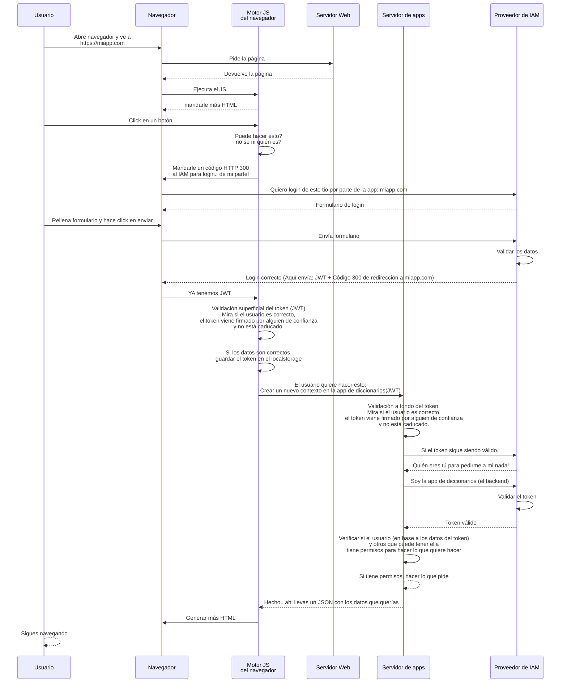

1º Repaso a la arquitectura de componentes de nuestro sistema

    Capa dominio
        Módulo: Definimos modelos y repositorios para editores
        Módulo: Definimos modelos y repositorios para búsqueda de palabras
        Módulo: Definimos modelos y repositorios para gestión de palabras y diccionarios
            * repositorios= Gestión básica de esos modelos.
        Módulo: Definimos entidades JPA y repositorios JPA
        Modulo: Implemente nuestro REPO de búsqueda de palabras contra JPA
        Modulo: Implemente nuestro REPO de gestión de palabras y diccionarios contra JPA
        MODULO: para implementar mi repo de editores contra LDAP

    Los repos JPA me dan métodos CRUD para trabajar contra BBDD relacionales
    Nuestros repositorios me dan los métodos que nosotros queremos tener (y exponer) para trabajar contra palabras y diccionarios

            BUSQUEDAS
                modelos
                repositorios (API)
                    Funciones para apañarme con las búsquedas de palabras
                                                            vv
                                                        Implementación de mi API de búsquedas
                                                            vv
                                                        API REST (funciones CRUD)
                                                            vv
                    BBDD Relacional  >> Proceso batch >> ElasticSearch
                         ^^
                      API JPA (funciones CRUD)
                         ^^
                Implementación de mi API de gestión de palabras y diccionarios
                         ^^
            GESTION      ^^
                modelos  ^^
                repositorios (API)
                    Funciones para apañarme con la gestión de palabras y diccionarios

2º Revisar la lógica que implementamos en NUESTRO repositorio

    Borrar un significado?
        Qué pasa con el orden del resto de significados si borro uno? Hay que cambiarles la propiedad NUMERO... pregunta. 
           - Es el repo el sitio adecuado para hacer eso?   TOTALMENTE
           - O eso debería ir en capa de negocio?           NUNCA EN LA VIDA

3º Excepciones

Ahora mismo en la implementación tenemos 5 implementaciones de nuestros repos.
Cada uno con n funciones (2-10) que pueden lanzar un InvalidArgumentException si los datos que se reciben no son adecuados.
Pero... como están implementados basándose en los repos JPA, lo que lanzarían ahora mismo es excepciones de JPA.

Me toda en todas esas funciones meter try{}catch que controlen las excepciones de JPA y las conviertan en InvalidArgumentException.
MUCHO TRABAJO... y QUE A NADIE SE LE OLVIDE EN UNA DE ESAS FUNCIONES!

Aquí es donde entra la PROGRAMACION ORIENTADA A ASPECTOS.
    - Spring AOP < Proxys 

Uno de los usos guays de esto es la gestion CENTRALIZADA de excepciones.


PROXY: Creamos una clase en tiempo de ejecución, que intercepta todas las llamadas a otra clase... BASICAMENTE NOS ESTAMOS AUTO-HACIENDO UN ATAQUE MAN IN THE MIDDLE A NOSOTROS MISMOS!


    ClaseB ---> Clase A
            ^
            Interceptar esa llamada y hacer algo antes y después de la llamada

    ClaseB ---> Proxy ---> Clase A

        La clase Proxy tiene las mismas funciones que la clase A (identicas) y dentro, en su implementación las llama a las funciones de la clase A.


        ```java 

        public class ClaseA { // << Esta clase se entera de algo? de que le están jaqueando? NO
            public void funcion1() {
                System.out.println("Hola");
            }
        }
        public class ClaseB {
            ClassA claseA; // <<< En lugar de pasarle una instancia de ClaseA, le paso una instancia de Proxy? Se entera?
            public void unaFuncion() {
                claseA.funcion1();
            }
        }
        public class Proxy { // Nos encanta esto! Si encima puedo hacer que estas clases se generen dinámicamente, MA-RA-VI-LLO-SO! = AOP
            ClassA claseA;
            public void funcion1() {
                System.out.println("Antes de llamar a funcion1");
                try{
                    claseA.funcion1();
                } catch (Exception e) {
                    System.out.println("Ha habido un error");
                }
                System.out.println("Después de llamar a funcion1");
            }
        }

        ```

Podemos crear una configuración en Spring que nos genere estos proxies automáticamente para todas las clases que queramos: @Aspect
```java
@Aspect // LENGUAJE DECLARATIVO: Spring, quiero que todas las funciones gestionen las excepciones de esta forma.
public class ExcepcionesAspect {
    @Around("execution(* com.curso.diccionarios.repositorio.impl.*.*(..))")
    public Object interceptar(ProceedingJoinPoint joinPoint) {
        try {
            return joinPoint.proceed();
        } catch (JpaDataIntegrityViolation e) {
            throws InvalidArgumentException("Error de datos");
        }
    }
}
```

Y esto, si es que Spring lee esta clase en el arranque (ComponentScan.. y los paquetes @SpringBootApplication) , Spring crea Proxies para todas las clases de ese paquete, añadiendo esa funcionalidad que pedimos en todas la funciones que le haya dicho... En nuestro caso, en TODAS.

Ventajas enormes:
- 1. En cada función me centro en su HAPPY_PATH: Lógica básica!
    Por tanto se entenderán, escribirán y mantendrán super bien! Al menos mucho mucho mucho más fácil que si tengo que meter try{}catch en todas las funciones.
- 2. Es mucho más robusto! Si me olvido de meter un try{}catch en una función, no pasa nada! El proxy se encargará de ello.
- 3. Es mucho más fácil tener 1 único sitio donde gestionar las excepciones. Si quiero cambiar el mensaje de error, lo cambio en un único sitio.

---


Ciencias de la computación = Física o Matemáticas es una CIENCIA EXACTA. Con leyes y principios que se cumplen siempre. PRINCIPIO = LEY

Ingeniería de software = Ingeniería civil o mecánica. No es una ciencia exacta. No hay leyes que se cumplan siempre. PRINCIPIO = Reglas por las que decido regirme en mi trabajo.
    SOLID, KISS, DRY, SOC, YAML = No son leyes que se cumplan siempre. Son reglas que me ayudan a tomar decisiones en mi trabajo.

Ingeniería: Crear o producir algo (software) teniendo en cuenta:
- Limitaciones de tiempo            \
- Limitaciones de recursos           > Presentes y futuras
- Limitaciones de conocimiento      /
- Limitaciones impuestas por normativas, leyes, etc.
- Condicionantes externos: Existen por ahí piratones que me van a hackear, por ejemplo.

Spring me ofrece una anotación especial para usar aspectos en peticiones REST, a nivel de controlador:
    @ControllerAdvice

```java
    @ControllerAdvice
    public class ExcepcionesControllerAdvice {
        @ExceptionHandler(JpaDataIntegrityViolation.class)
        public ResponseEntity<String> gestionarExcepcion(JpaDataIntegrityViolation e) {
            return ResponseEntity.status(HttpStatus.BAD_REQUEST).body("Error de datos");
        }
    }

```

---


BBDD relacionales

Guardan datos estructurados.
Qué tal van las búsquedas en una BBDD?
    - Proc. más BASICO que tienen es FULL SCAN: Recorrer toda la tabla buscando lo que le pides. EFICIENTE? NO.
    - Proc. más AVANZADO: BUSQUEDA BINARIA. BUSCAR EN UN DICCIONARIO!
      Para poder hacer esto, hay un requisito: DATOS ORDENADOS
        Ordenar bajo demanda es lo peor que puedo pedir a un ORDENADOR!
        Solución: CREAR INDICES
            INDICE = Copia (Duplicado) ordenada de los datos.
        Las BBDD Recopilan ESTADISTICAS! Para optimizar los 2 primeros cortes de un índice.

TITULOS
----------------------
1 Tortilla-de-patatas
2 Patatas con garbanzado
3 Papatas a lo pobre
4 Pulpo con patatas

    patatas -> FULLSCAN <- LIKE %LOQUESEA
                UPPER(TITULO) = LIKE "%" + UPPER('patatas')

Las BBDD son expertas en INDICES DIRECTOS.
Pero hay un concepto que se llama "INDICE INVERSO" que es un poco más complicado.
    
    tortilla    1(1)
    patata      1(3), 2(1), 3(1), 4(3)
    pobre       3(4)
    pulpo       4(1)

    patatas -> INDICE INVERSO -> 1, 2, 3, 4
                está en el índice inverso "patata"? Ahí si puedo aplicar una BUSQUEDA BINARIA.

    En general las BBDD son una mierda gestionando indices inversos. Lo que gestionan bien son los indices directos.

    Y para los inversos hay otro concepto que se llama "INDEXADORES" que es un poco más complicado: Elastisearch, Solr, etc.

---

Guardo los datos en BBDD Relacional.
    Necesito un campo numero
Guardo los datos en MongoDB... que lo que guarda es un JSON
    {
        "palabra": "patata",
        "significados": [
            {
                "definicion": "Plato"
            }
        ]
    }

---                                                                          Importación
                                                                                vv
----------Frontal-----------------   -------------------------Back-----------------------------
Formulario WEB  > Servicio Frontal > ControladorREST > Servicio de negocio > Repo Dominio > BBDD (PL/SQL)
 * Campo DNI
                                                        *****************     !!!!!!!!!
**************     **************                                             IMPORTANTE
                   **************
                   **************
    ^
 Lógica            Comunicarla        Lógica de exposición   Lógica de negocio  Lógica de los   Persistir los datos
 recoger            al back             el servicio             negocio          datos
 información                          por protocolo REST
                                                                              ^^^^^^^^     ^^^^^

Me dicen, como requisito! que solo puedo poner la validación de la estructura del DNI en un único sitio.
Cuál sería?

Voy a dejar a la gente que ataque directamente a la BBDD?
    SQL (carga en batch por las noches)? SI -> BBDD es la que deben tener el chequeo.
Si no voy a dejar a la gente que ataque directamente a la BBDD? (QUE SERIA LO MAS SENSATO!)
    El chequeo va a capa de dominio

Un DNI es un DNI. En mi negocio y en cualquier otro negocio. La lógica de tener 8 numeritos y una letra no es lógica de negocio. Es lógica de estructura de datos.
Igual que una fecha es dia, mes y año. Eso es lógica de estructura de datos.
Igual que una palabra tiene significados ordenados. Eso es lógica de estructura de datos.

DNI =  de 1 a 8 dígitos seguido de una letra.

---
Yo tengo que poner la validación en el único sitio donde debe ir!
Adicionalmente puedo poner validaciones de cortesía!


---


BAJO NIVEL (Desde abajo) - Capa dominio -> Cuando tengo un sistema MUY PERO QUE MUY CLARO! Puedo empezar por abajo

Si el sistema no lo tengo tan claro... me suele interesar más empezar por arriba: Capa de Controladores REST
Y hacer lo que llamamos API DRIVEN DEVELOPMENT
    - Definir la API REST que quiero tener
    - Implementar esa API REST
    - Implementar la lógica de negocio que necesito para esa API REST
    - Implementar la persistencia de datos que necesito para esa lógica de negocio

Pero además vamos a aplicar otra cosa que nos va a venir GUAY!
    - TDD (Test Driven Development)

        TDD = Test First + Refactor
        TDD: Voy a ir creando test.. y voy a hacer lo mínimo que necesito hacer para que cada test pase.
        La idea es ir creando juntos las funciones y los tests.
        Me aseguro así que cada funcionalidad tiene un test que la cubre.

    - Vamos a partir de Test de integración por estar en capa de controlador
          Cliente HTTP -> [Servidor de aplicaciones (TOMCAT) -> Controlador REST ]-> Servicio de negocio -> Repo de dominio -> BBDD 

---

                                                                                            diccionarios-dominio-busqueda (API)     <-+
                                                                                                ^                                     +- diccionarios-persistencia JPA (IMPL)
                                                                                            diccionarios-dominio-gestion (API)      <-+
                                                                                                    ^
                                                diccionarios-servicios-busqueda (API) <- diccionarios-servicios-busqueda (IMPL)

                                                diccionarios-servicios-gestion (API)  <- diccionarios-servicios-gestion (IMPL)
                                                        ^                                                                       ^        ^
    controlador-REST-busqueda (API)       <- controlador-REST-V1-busqueda (IMPL)                                         <-
                                                                                                                                Aplicacion
    controlador-REST-gestion (API)        <- controlador-REST-gestion (IMPL)                                             <- 

                                          <- controlador-REST-V2-busqueda (IMPL)                                         <-

                                              configuracion de seguridad                                                 <-

----

# Seguridad

2 Opciones grandes para trabajar...  2 planteamientos!
A quién le doy la responsabilidad de decidir / aplicar la seguridad?
- Cada desarrollador de cada componente debe encargarse de configurar la seguridad de su componente
- Quiero que los desarrolladores se centren en desarrollar... y posteriormente centralizar todo lo relativo a seguridad en un único sitio.

Dependerá del equipo de trabajo y del proyecto en el que esté!
- Centralizado está guay!... Pero necesito alguien con vision completa del sistema.. y que cuando cada desarrollador haga un cambio, se asegure de que se introduce en la configuración de seguridad. Esto me da una visión holística del sistema. Veo toda la seguridad en un sitio = GUAY!
- Descentralizado está guay!... Pero necesito que cada desarrollador sea consciente de los requisitos de seguridad
  Esto me permite en cada funcion de cada componente ver rápidamente qué seguridad tiene. = GUAY!

No pasa nada.. Spring nos permite trabajar de las 2 formas! Elegiré una u otra en función de las necesidades del proyecto.

---

# Como funciona esto de la seguridad en Spring?

Para hablar de esto, primero debemos hablar un poco de cómo han evolucionado las aplicaciones web.

Antiguamente las apps web eran StateFull. Cuando un usuario se conectaba con el servidor de aplicaciones la primera vez (antes de hacer login),
el servidor (tomcat, weblogic, etc) le asignaba un ID de sesión JSESSIONID. Ese identificador se mandaba a los clientes mediante una cookie.
Cada vez que un cliente hacía una petición al servidor, mandaba esa cookie. El servidor la leía y sabía a qué sesión pertenecía esa petición.

SESSION? = HttpSession = Map<String, Object>

    Una sesión es un mapa (estantería) donde dejábamos cosas de los usuarios. Cada usuario teñía su MAPA, su HTTPsession creada en el servidor...
    y el servidor se responsabilizaba de mantenerla.

        sesiones = Map<String, Map<String, Object>>
                         ^
                         JSESSIONID

Esto era un follón... 
-   porque si tenías 1000 usuarios conectados, tenías 1000 sesiones en memoria. Aunque los usuarios no estuvieran haciendo nada en ese momento.
    Al final me quedaba sin memoria.... y teníamos que configurar cosas como: "Si un usuario no hace nada en 30 minutos, le cierro la sesión"
-   Que pasa si tengo mi aplicación en servicio desde 2 servidores? Por delante montamos un Balanceador de carga... y el balanceador de carga
    tiene que tener una configuración especial para que las peticiones de un mismo usuario vayan siempre al mismo servidor: Sticky Sessions
    Claro... y si se cae el servidor 1... el balanceador de carga le mandaba al otro... pero en el otro estaban los datos de la sesión del usuario? 
    NO... al menos a priori... Y empezamos a montar sistemas de replicación de sesión (usando caches) distribuidos... y era un follón:
    - Redis
    - Infinispan

Cuando un usuario hacía login, el servidor tenía su propia estructura de datos para representar a un usuario logueado. (User)
Y al hacer login, se cargaban los detalles del usuario (nombre, roles, etc) en ese objeto y ese objeto se guardaba dentro de la sesión.

    sesiones = Map<String, Map<String, Object>>
                                        ^
                                "user", Datos del usuario logueado

solíamos meter un filtro HTTPRequest que miraba si en la sesion del usuarios (JSESSIONID) había una entrada "user"... Si no -> Le redirigía a la página de login.


---

Hoy en día, las cosas han cambiado mucho. Hoy en día nos encantan las aplicaciones StateLess.. que no guardan información del usuario en el servidor.
El usuario (la app cliente) es responsable de los datos del usuario.. Y deberá mandar en cada petición todos esos datos:
- Nombre de usuario
- Roles
- etc

---
# Otro temita

Antiguamente, los desarrolladores implementaban la seguridad de sus aplicaciones web de forma manual.
    - Creabamos tablas de usuarios... donde guardar los usuarios con sus contraseñas
    - Creabamos tablas de roles... donde guardar los roles de los usuarios
    - Montábamos pantallas de administración para dar de alta usuarios, roles, etc
Y en otro aplicación lo mismo.. y en otra lo mismo... y en otra lo mismo...

Problemón:
- Datos replicados por 50 aplicaciones (además datos sensibles)
- Usuarios con 50 contraseñas distintas
- Los desarrolladores no TENEMOS NPI de seguridad.... y está bien... no tengo por qué tenerla... pero no debería ser mi responsabilidad. (a)
Empezamos a montar cosillas para paliar esto: SSO, LDAP, etc


Hoy en día usamos proveedores de IAM: Identity and Access Management
    - Okta
    - Keycloak
    - Auth0
    - Azure AD
    - Google Identity
    - AWS Cognito
    - etc
Tiene sus propias BBDD de usuarios y roles... BIEN MONTADAS
Soportan sistemas de doble factor de autenticación
Soportan federación de identidades (LDAP, SAML, etc)
Soportan integración con otros proveedores de IAM: Google, Facebook, Github, etc
---

Hay un estandar (no es el único) para todo esto hoy en diá: OpenID Connect
    - OAuth2
    - JWT
---

JWT: es una cadena de texto, sometida a un cambio de base (base64)
que incluye 3 documentos JSON:
    - HEADER: Algoritmo de codificación
    - PAYLOAD: Datos del usuario (nombre, fecha de expiración, roles, email, etc)
    - FIRMA: Firma de los datos realizada por un proveedor de IAM de confianza

# Identificacion vs Autenticación vs Autorización

Identificación: Decir quien soy
Autenticación:  Comprobar que soy quien digo ser
Autorización:   Sabiendo que eres quien dices ser, qué puedes hacer?


Esta es la tendencia... no todo funciona así... por desgracia!

Desde el punto de vista de Spring, Spring Security es el módulo que nos permite trabajar con seguridad en nuestras aplicaciones.
- Vamos a tener un contexto de seguridad en nuestra aplicación.
- Cuando un usuario se conecta a la aplicación, se le asigna un contexto de seguridad, en ese contexto se guardan los datos del usuario.
- Ese contexto puedo guardarlo entre peticiones (StateFull) o no (StateLess)
- Los datos del usuario se sacan de una BBDD de usuarios (UserServiceDetails)
- Y Aun usuario le autentico con un AuthentizationManager
(Puede ser que configure a Spring Security para que me valide los tokens JWT... y que configure a Spring Security para que me valide los tokens JWT y saque de ellos los roles... o que solo saque el usuario y los roles los saque de una BBDD de roles (UserServiceDetails))

El hecho, es que cómo sea que se trabaje (StateFull o Stateless - Autenticador interno o externo - Roles en BBDD o en JWT) Spring en todo momento me permite informarme de quién es el usuario que está haciendo la petición y qué roles tiene.

Configuraré en Spring como quiero que se gestione la autenticación y la autorización de mi aplicación: Saber quien es y que roles tiene un usuario.

Eso será una CONFIGRUACION de mi aplicación. Nada más.
De cara a desarrollar los componentes de mi aplicación, no me importa cómo se gestiona la seguridad. Me importa que se gestione.

Para mi, desarrollador de un componente, un usuario es un usuario y tiene roles. Punto pelota!!! Podré hacer uso de esa información.. y autorizar o no a un usuario a hacer algo en mis funciones. Si me lo permiten! quien sea que esté gestionando la seguridad de mi aplicación.

O puede ser que no me lo permitan y haya alguien que gestione todas las reglas de seguridad de la aplicación (de mi componente y de otros 20 componentes) en un único sitio.


---

(a) Cómo se debe guardar una contraseña en una BBDD? Encriptada

NI PUTA TENEMOS ! Una contraseña NO SE GUARDA EN BBDD!!! Se guarda un HASH de la contraseña (Huella)
De hecho hay forma de saber la contraseña desde la huella: FUERZA BRUTA!
Por eso, los sistemas buenos tampoco guardan la huella... Sino la huella de la huella de la huella de la huella Y asi unas 1024 veces. Olvidate de fuerza bruta! No hay tiempo desde el big bang para descifrar eso.

Algoritmo de huella? Función que:
- Dato un dato siempre genera el mismo resultado (HASH = HUELLA)
- Hay "poca" probabilidad de que 2 datos distintos generen el mismo resultado: 1/23 = 4%
  Para el ministerio de interior, un 4% es lo suficientemente bajo: PROBABILIDAD DE COLISIÓN
  En informática solemos utilizar algoritmos con una probabilidad de colisión de 1 entre trillones
- Desde el resultado debe ser impossible (o muy difícil) obtener el dato original (El resultado es un resumen del dato original)

Ej. de algoritmo de huella que todos habéis usado desde que tenéis 10 años: LETRA DEL DNI

    23000012 | 23
             +-----------
          12   1000000 (me la suda)

          ^ RESTO es lo importante.. que un DNI puede estar entre 0-22
          Y el ministerio da una tabla con las letras que corresponden a cada resto